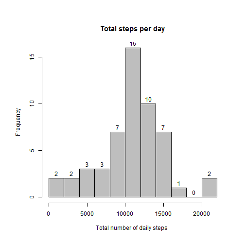
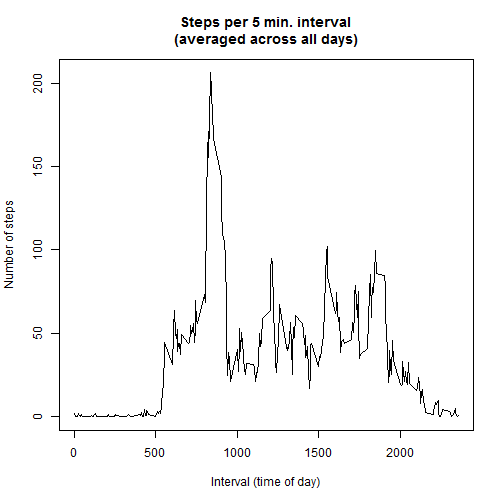
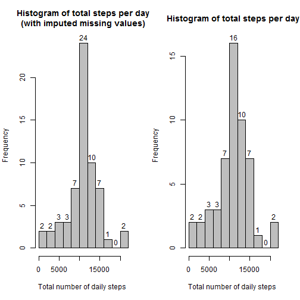
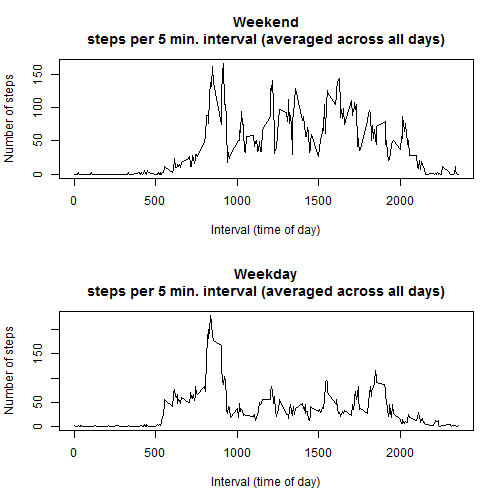

## Loading and preprocessing the data

Preprocessing of data focuses on the date & time formats of the date and interval columns. Basically - preparing them for subsequenct use.


```r
activityData_all <- read.csv("activity.csv")

# remove NAs
activityData <- activityData_all[complete.cases(activityData_all),]

# fix dates
fixdates <- function(activityData){
    activityData$date <- as.Date(activityData$date, "%Y-%m-%d")
    activityData$interval <- sprintf("%04d",activityData$interval)
    activityData$interval_time <- paste(substr(activityData$interval, 0, 2)
                                        , ":",substr(activityData$interval, 3, 4), sep=""
                                        )
    activityData$date_time <- strptime(paste(activityData$date, activityData$interval_time), "%Y-%m-%d %H:%M")
    return(activityData)
}
activityData <- fixdates(activityData)
```

The result of the preprocessing phase is displayed below, using the ```head``` function:


```r
head(activityData)
```

```
##     steps       date interval interval_time           date_time
## 289     0 2012-10-02     0000         00:00 2012-10-02 00:00:00
## 290     0 2012-10-02     0005         00:05 2012-10-02 00:05:00
## 291     0 2012-10-02     0010         00:10 2012-10-02 00:10:00
## 292     0 2012-10-02     0015         00:15 2012-10-02 00:15:00
## 293     0 2012-10-02     0020         00:20 2012-10-02 00:20:00
## 294     0 2012-10-02     0025         00:25 2012-10-02 00:25:00
```


## What is mean total number of steps taken per day?


```r
totalStepsPerDay <- aggregate(steps ~ date , activityData, FUN = sum) 

par(mfrow=c(1,1), mar=c(4,4,4,1), oma=c(2,2,2,2))

histstepsperday <- function(totalStepsPerDay, main){
    hist(totalStepsPerDay$steps
         , main = main 
         , xlab = "Total number of daily steps "
         , ylab = "Frequency"
         , labels = TRUE
         , col="gray"
         , breaks = 10
    )
}

histstepsperday(totalStepsPerDay, "Total steps per day")
```

 

Note: I will be using the ```histstepsperday``` function later on, in order to visually compare imputed data with the 'clean' (without NAs) data.

### Mean and Median calculation


```r
median_steps_per_day <-  as.integer(median(totalStepsPerDay$steps))
mean_steps_per_day <- as.integer(mean(totalStepsPerDay$steps))
```

|||
|--- |--- |
| **Median:** |10765 |
| **Mean:** | 10766|

 


## What is the average daily activity pattern?


```r
interval_mean <- aggregate(steps ~ interval , activityData, FUN = mean) 

names(interval_mean)[2] <- "steps_mean"

plotstepsinterval <- function(data, main){
    plot(data$interval, data$steps_mean
         , type = "l"
         , main = main # "Steps per 5 min. interval\n(averaged across all days)"
         , xlab = "Interval (time of day)"
         , ylab = "Number of steps"
    )
}

plotstepsinterval(interval_mean, "Steps per 5 min. interval\n(averaged across all days)")
```

 

### Which 5-minute interval, on average across all the days in the dataset, contains the maximum number of steps?


```r
intervals_sorted <- interval_mean[order(-interval_mean$steps_mean),] 
head(intervals_sorted)
```

```
##     interval steps_mean
## 104     0835   206.1698
## 105     0840   195.9245
## 107     0850   183.3962
## 106     0845   179.5660
## 103     0830   177.3019
## 101     0820   171.1509
```

**On average across all days, the maximum number of steps per interval occur at 0835**.


## Imputing missing values


### 1. Calculate and report the total number of missing values in the dataset (i.e. the total number of rows with NAs)


```r
na_rows <- nrow(activityData_all) - nrow(activityData)
```
There are 2304 rows containing NA values.


### 2. Devise a strategy for filling in all of the missing values in the dataset.

I decided to use the mean value (averaged across all days) to fill-in for the missing interval.


### 3. Create a new dataset that is equal to the original dataset but with the missing data filled in.


```r
activityData_all <- fixdates(activityData_all)
activityData_all <- merge(activityData_all,interval_mean,by="interval")
activityData_all[is.na(activityData_all$steps),2] <- as.integer(activityData_all[is.na(activityData_all$steps),6])
```


### 4. Make a histogram of the total number of steps taken each day


```r
totalStepsPerDay_all <- aggregate(steps ~ date , activityData_all, FUN = sum) 

histstepsperday(totalStepsPerDay_all, "Histogram of total steps per day\n(with imputed missing values)")

par(mfrow=c(1,2))
histstepsperday(totalStepsPerDay_all, "Histogram of total steps per day\n(with imputed missing values)")
histstepsperday(totalStepsPerDay, "Histogram of total steps per day")
```

 


#### Calculate and report the mean and median total number of steps taken per day. 


```r
median_step_per_day <- as.integer(median(totalStepsPerDay$steps))
median_step_per_day_imputed <- as.integer(median(totalStepsPerDay_all$steps))

mean_step_per_day <- as.integer(mean(totalStepsPerDay$steps))
mean_step_per_day_imputed <- as.integer(mean(totalStepsPerDay_all$steps))
```

|Function| Unimputed | Imputed | Difference |
|--- |--- |---|---|
| **Median:** |10765 | 10641| 124 |
| **Mean:** | 10766| 10749 | 17| 


#### Do these values differ from the estimates from the first part of the assignment?  

The imputed strategy I chose (see above) reduces the mean somewhat, and widens the gap between median and mean values.

#### What is the impact of imputing missing data on the estimates of the total daily number of steps?

The imputed data impacts the total daily number of steps by increasing the median values (10,000-12,000 steps per day) from ocurring on 16 days to ocurring on 24 days.

## Are there differences in activity patterns between weekdays and weekends?


```r
weekend <- c("Saturday", "Sunday")

new_activitydata_all <- activityData_all
new_activitydata_all$is_weekend <- weekdays(new_activitydata_all$date) %in% weekend
new_activitydata_all$weekday <- weekdays(new_activitydata_all$date)

#### Weekend

weekend_activity <- new_activitydata_all[new_activitydata_all$is_weekend == TRUE,]

weekend_activity_mean <- aggregate(steps ~ interval , weekend_activity, FUN = mean) 
names(weekend_activity_mean)[2] <- "steps_mean"
weekend_activity_mean$steps_mean <- as.integer(weekend_activity_mean$steps_mean)
    
par(mfrow=c(2,1))
plotstepsinterval(weekend_activity_mean
                  , "Weekend\nsteps per 5 min. interval (averaged across all days)"
                  )

#### Weekday

weekday_activity <- new_activitydata_all[new_activitydata_all$is_weekend == FALSE,]

weekday_activity_mean <- aggregate(steps ~ interval , weekday_activity, FUN = mean) 
names(weekday_activity_mean)[2] <- "steps_mean"
weekday_activity_mean$steps_mean <- as.integer(weekday_activity_mean$steps_mean)


plotstepsinterval(weekday_activity_mean
                  , "Weekday\nsteps per 5 min. interval (averaged across all days)"
)
```

 

Overall, there is less activity on a weekend. The daily 08:30-09:30 peaks of activity are still there during weekend days, and they are quite similar to weekday peak activity levels, but throughout the rest of the weekend daysthere is less activity.

